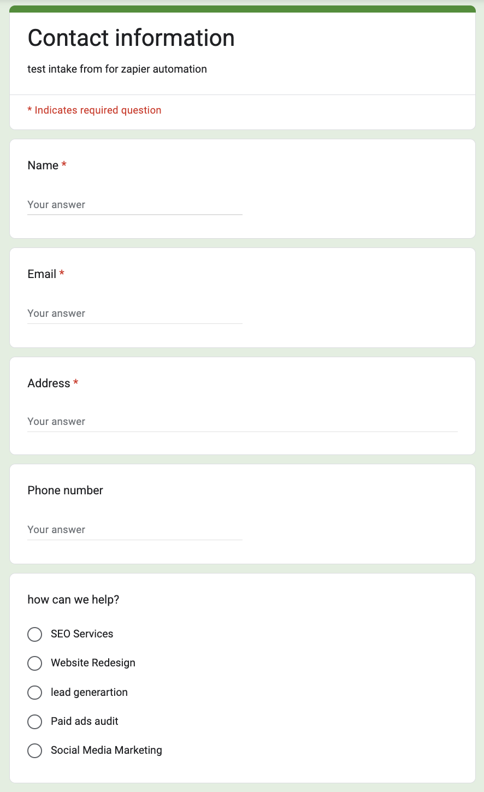
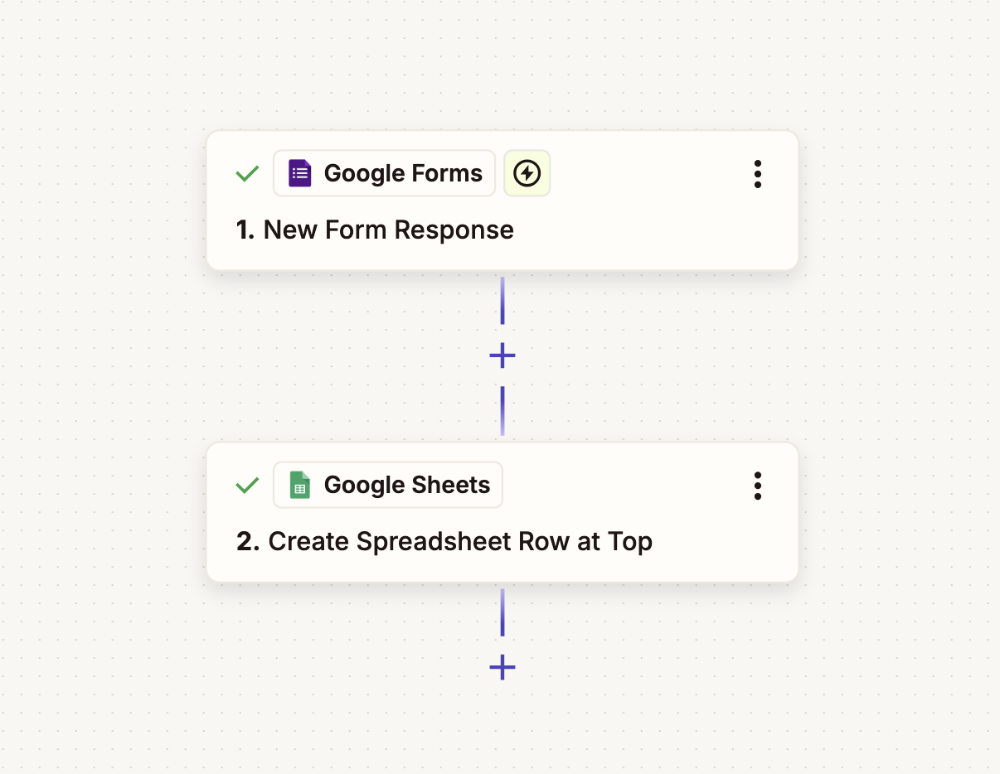
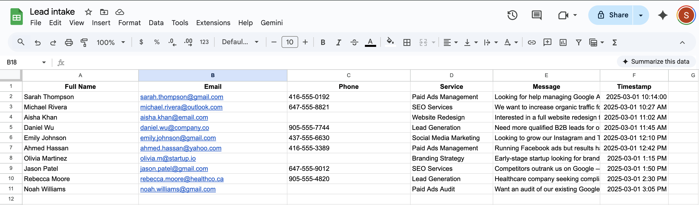

# 🚀 Lead Capture & Logging Automation

A reliable, low-risk automation system designed for marketing agencies to capture, standardize, and log inbound leads with zero manual effort.

---

## 📌 Overview
This project implements a **lead capture and logging system** for a marketing agency.  
Its purpose is to ensure that every inbound inquiry is **captured, cleaned, timestamped, and stored** in a single source of truth.

The system prioritizes **simplicity, reliability, and auditability**, making it easy for non-technical teams to operate and maintain.

---

## ❗ Problem
Marketing agencies often receive leads through web forms, but manual handling leads to:

- ❌ Missed or delayed follow-ups  
- ❌ Inconsistent data formatting  
- ❌ Duplicate or incomplete records  
- ❌ Poor visibility into total lead volume  

These issues increase operational friction and reduce conversion speed.

---

## ✅ Solution
An automated workflow that:

- Triggers on every new form submission  
- Cleans and standardizes incoming lead data  
- Logs each lead into a structured spreadsheet  
- Automatically timestamps every entry  
- Creates a **single, reliable record** of all inbound leads  

This removes manual data entry and significantly reduces the risk of missed inquiries.

---
## 🧰 Tech Stack

- 📝 **Google Forms**  
  Lead intake and data collection

- ⚙️ **Zapier**  
  Workflow orchestration and automation logic

- 📊 **Google Sheets**  
  Central system of record and audit log

---

## 🔄 Workflow Summary

### 1️⃣ Lead Intake — Google Form
Leads submit their information through a standardized web form.

---

### 2️⃣ Automation — Zapier Workflow
Each form submission triggers an automation that maps, cleans, and prepares lead data for storage.

---

### 3️⃣ Centralized Logging — Google Sheets
Every submission is written as a single row in a structured spreadsheet, creating an auditable lead log.

---

## 🎯 Outcome
- ✅ All inbound leads are captured automatically  
- ✅ Data is consistent and easy to review  
- ✅ No manual copying or pasting is required  
- ✅ The agency has a clear, centralized view of inquiries  

This system improves response speed and operational reliability.

---

## 📏 Success Criteria
- One spreadsheet row per form submission  
- No missing required fields  
- Consistent formatting across entries  
- Automatic timestamping  
- Easy filtering and review by the agency team  

---

## ⚠️ Edge Cases Considered
- Empty optional fields (e.g., phone number)  
- Duplicate email submissions  
- Inconsistent name capitalization  
- Long free-text messages  
- High submission volume without data loss  

---

## 📈 Future Enhancements
- Slack or email notifications for high-intent leads  
- CRM (HubSpot) integration  
- Lead routing based on service interest  
- Error monitoring and alerting
